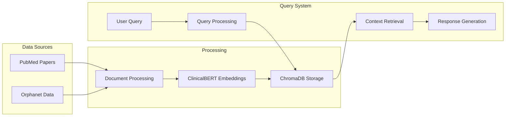

# RareDisease-RAG-System:-Evidence-Based-Clinical-Information-Platform

A specialized Retrieval-Augmented Generation (RAG) system that combines clinical data from Orphanet and PubMed research papers to provide comprehensive, evidence-based information about rare diseases. The system leverages ClinicalBERT embeddings and ChromaDB for efficient retrieval, enabling healthcare professionals and researchers to access detailed information about disease manifestations, genetic factors, and current research findings.

## 🔄 RAG Pipeline


## 🌟 Key Features
- Disease-Specific Information Retrieval
- Research Paper Analysis
- Clinical Feature Extraction
- Genetic Information Processing
- Evidence-Based Insights

## 💻 Technical Architecture
1. **Data Collection**
   - PubMed Research Papers
   - Orphanet Disease Information
   - Clinical Features Database

2. **Processing Layer**
   - Text Preprocessing
   - Document Chunking
   - ClinicalBERT Embeddings
   - ChromaDB Vector Storage

3. **Analysis Layer**
   - RAG-based Information Retrieval
   - Clinical Feature Extraction
   - Research Paper Integration

## 🚀 Quick Start
```python
# Install dependencies
pip install llama-index chromadb gradio openai transformers

# Set OpenAI API key
export OPENAI_API_KEY='your-key-here'
```

### Example Query
```
User: "What are the main clinical features of Stoneman syndrome?"

```

## 📊 Sample Output
```json
{
    "disease_info": {
        "name": "Stoneman syndrome",
        "orpha_code": "157791",
        "clinical_features": {
            "skeletal": [
                "Progressive ossification of connective tissue",
                "Limited joint mobility",
                "Spine fusion",
                "Restricted chest wall movement"
            ],
            "other_manifestations": [
                "Hearing impairment",
                "Facial features alterations",
                "Reduced mouth opening"
            ]
        },
        "genetic_info": {
            "inheritance": "Autosomal dominant",
            "gene": "ACVR1",
            "mutations": "Activating mutations in ACVR1 gene"
        }
    },
    "research_papers": [
        {
            "title": "Clinical and molecular findings in progressive osseous heteroplasia",
            "key_findings": [
                "Role of ACVR1 mutations",
                "Disease progression patterns",
                "Treatment approaches"
            ],
            "publication_year": "2023"
        }
    ]
}
```

## 🛠️ Technologies Used
- LlamaIndex
- ChromaDB
- ClinicalBERT
- OpenAI GPT-4
- Gradio

## 📁 Project Structure
```
rare_disease_rag/
├── data/
│   └── RareDisease_data.json
├── src/
│   ├── data_collection.py
│   ├── rag_Pipeline.py

```

## 🔍 Use Cases
- Clinical Research
- Medical Education
- Healthcare Professional Reference
- Patient Information Access

## 📈 Capabilities
- Disease Information Retrieval
- Research Paper Analysis
- Clinical Feature Extraction
- Evidence-Based Insights
- Interactive Query Interface
